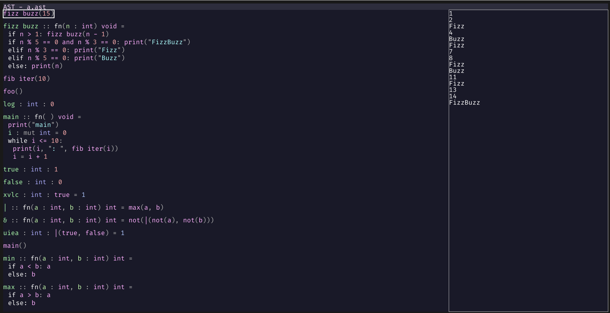
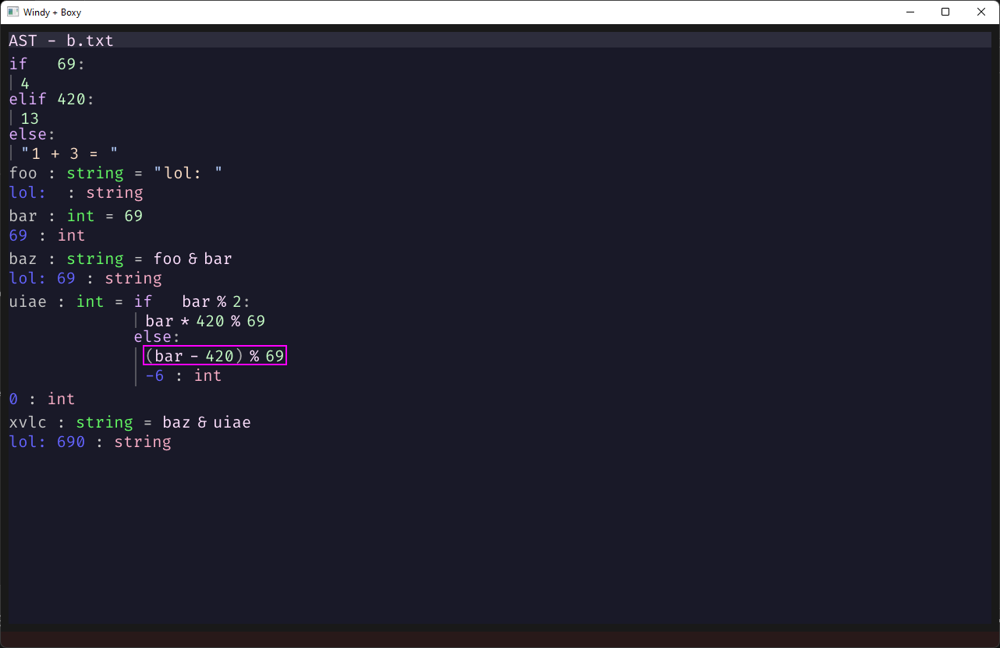
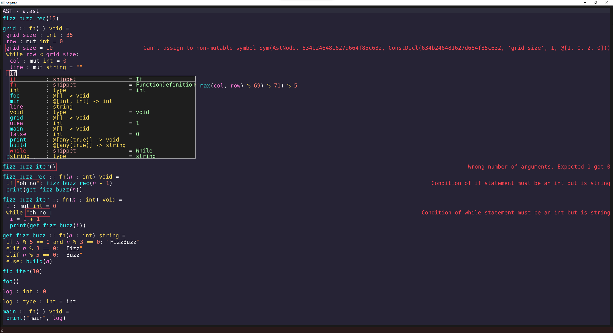

# Absytree

This is still very early in developement and very experimental!

Written in Nim

## Programming Language + Editor

Absytree is a text editor + programming languange workbench where instead of writing the source code as text in text files,
the abstract syntac tree (AST) is edited directly (or rather through _projections_, which are still trees)
Languages will be extendable with custom AST node types, by either translating those to nodes of other languages or by implementing code generation
for the backend (at the moment only WASM).

The editor is available for the terminal, as a desktop GUI app and in the browser.
You can try the browser version [here](https://nimaoth.github.io/AbsytreeBrowser/) ([old version](https://nimaoth.github.io/AbsytreeBrowser/old/absytree_browser.html)).

`ast` is the gui version, `astt` is the terminal version

## Goals
- For the text editor:
  - Sit somewhere inbetween Vim and VS Code
  - The most important tools are built in (e.g. syntax highlighting with tree-sitter, LSP support)
  - Can be used purely as a text editor (ignoring the AST language framework)
  - Little to no configuration needed to get nice experience out of the box
  - Support Vim motions
- General goals:
  - Keyboard focused (only basic mouse support)
  - Easily extendable with scripting
  - Good performance

## Inspirations
- [JetBrains MPS](https://github.com/JetBrains/MPS)
- [Dion Systems Editor](https://dion.systems/gallery.html)

## Building

### Setup
- Requires OpenGL 4.1 for the GUI version
- Install Nim version 2.0.2
- Clone the repository
- Run `nimble setup`

### Desktop version
- Use `nimble buildDesktop` to compile the desktop version of the editor.
- The release builds are built with:
  - For the gui version: `nimble buildDesktop --app:gui -D:forceLogToFile -D:enableGui=true -D:enableTerminal=false`
  - For the terminal version: `nimble buildDesktop --app:console -D:forceLogToFile -D:enableGui=false -D:enableTerminal=true`

### Browser version
- Run `nimble buildBrowser`
- Embed the generated file `ast.js`
- See `absytree_browser.html` for an example

### Compiling tree sitter grammars to wasm
- Go into the tree-sitter repositories root directory
- Make sure the cli is built
  - `cargo build`
- Compile the desired language to wasm. The specified directory is the one containing the `src` folder which in turn contains the `grammar.js`
  - `target/release/tree-sitter build-wasm ../dev/nimtreesitter/treesitter_nim/treesitter_nim/nim`

### Compiling tree sitter wasm binding
- Go into the tree-sitter repositories root directory
- Build the binding:
  - `script/build-wasm`
- Copy the generated files to the AbsytreeBrowser directory:
  - `cp lib/binding_web/tree-sitter.js <.../AbsytreeBrowser> && cp lib/binding_web/tree-sitter.wasm <.../AbsytreeBrowser>`

## Configuration

### options.json
`options.json` contains simple values which are used by the editor. This file is automatically created when exiting the editor with the current options.
When the editor launches it loads the current options from this file again (before running any scripts/plugins)

### Scripts/Plugins

Absytree supports different scripting languages/mechanisms. The editor API is exposed to each one and can be used to create new commands, change options, etc.
- NimScript: Only supported in the desktop version. The editor bundles part of the Nim compiler so it can run NimScript code.
  Allows easy hot reloading of the config file, but right now only one nimscript file is supported.
  Slightly increases startup time of the editor.
- Wasm: Works on the desktop and in the browser. In theory any language can be used to write plugins if it can compile to wasm.
  Probably better performance than NimScript.
- In the future the builtin language framework will be usable as a scripting language as well by compiling to wasm.

At startup Absytree loads the following scripts in order:
- `config/absytree_config_wasm.wasm`
- `config/absytree_config.nim` (NimScript, only in desktop version)

At the moment `config/absytree_config_wasm.wasm` is generated from `config/absytree_config.nim` by compiling it to wasm using `config/config.nims` (uses Emscripten). So `absytree_config.nim` can be used as NimScript or as a wasm plugin.

The editor API is exactly the same in both cases.

Inside `absytree_config.nim` one can check if it's being used in wasm or NimScript using the following check:

    when defined(wasm):
      # Script was compiled to wasm
    else:
      # Script is being interpreted as NimScript

`absytree_config.nim` must import `absytree_runtime`, which contains some utility functions. `absytree_runtime` also exports `absytree_api`,
which contains every function exposed by the editor. `absytree_api` is automatically generated when compiling the editor.

There are a few utility scripts for defining key bindings.
- `import keybindings_normal`: Standard keybindings, like most text editors. (e.g. no modes)
- `import keybindings_vim`: [Vim](https://github.com/neovim/neovim) inspired keybindings, work in progress. Will probably never be 100% compatible.
- `import keybindings_helix`: [Helix](https://github.com/helix-editor/helix) inspired keybindings, work in progress. Will probably never be 100% compatible.

Each of these files defines a `load*Bindings()` function which applies the corresponding key bindings. After calling this function one can still override specific keys.

More details in [Getting Started](docs/getting_started.md)

### Compiling Nim config files to wasm
- You need to have Emscripten installed.
- Run `nimble buildNimConfigWasm` from the root folder of the repository

## Screenshots

# Todo
- get [https://github.com/treeform/vmath/pull/67] merged and change vmath back to original repo
- finish [https://github.com/tree-sitter/tree-sitter/pull/2091]

- add nicer way to write:
  - StringGetPointer, StringGetLength
  - <, <=, etc
- add bool type
- make [] work with strings
- add char literal
- add string escape and/or allow entering \n
- auto open completion window?
- auto accept completion exact match even if other/longer completions exist
- render actual types in type placeholders
- add text based search (fuzzy?)
- add validation for all ast node types
- allow deleting selection in e.g. property cells
- make node reference not editable
- don't allow node substitution keys on empty expressions
- improve auto parenthesis for cells
- add struct scoped functions
- support copying multiple nodes
- fix deleting e.g struct member type bug
- negative number literal, float literal
- render cell indentation guides
- invalidate models using language X when X gets rebuilt
- finish/revise using string as parameter type for wasm functions (see createWasmWrapper, createHostWrapper)
- fix potential issues because of loading order when loading test-language and test-language-playground

[Test report](https://nimaoth.github.io/Absytree/testresults.html)