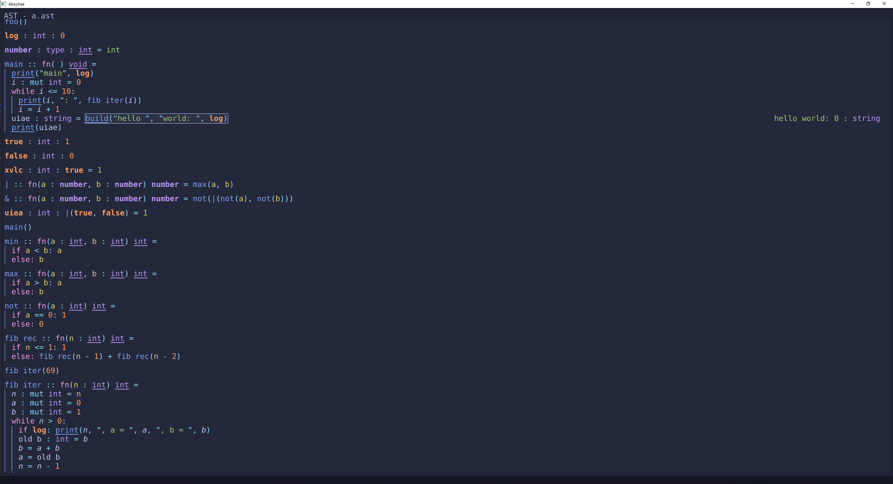
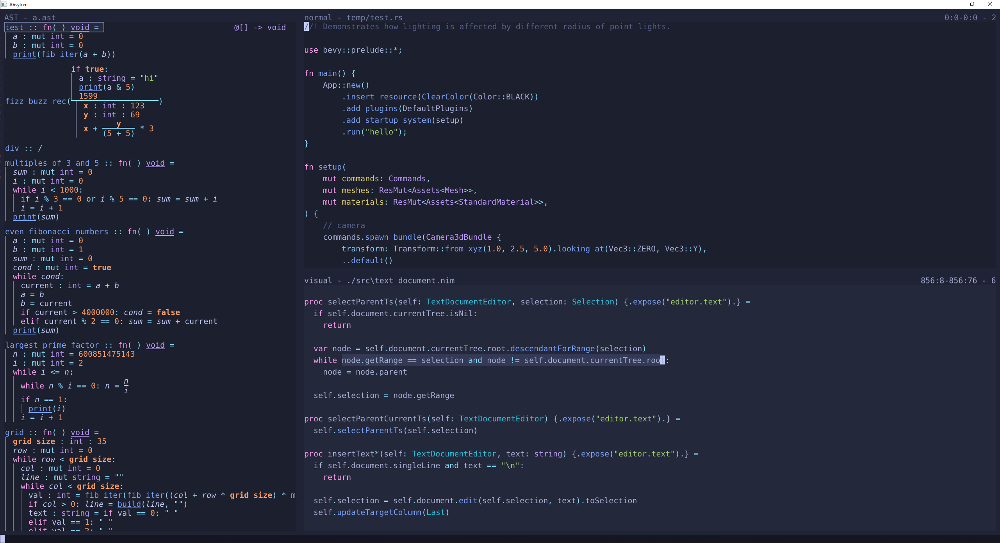

# Absytree

This is still very early in developement and very experimental!

## Programming Language + Editor

Absytree is a programming languange where instead of writing the source code as text in text files,
the abstract syntac tree (AST) is edited directly by a custom editor.

## Editor

The editor is available for the terminal, as a desktop GUI app and in the browser.
You can try the browser version [here](https://nimaoth.github.io/AbsytreeBrowser/).

[Test report](https://nimaoth.github.io/Absytree/testresults.html)

## Building

### Setup
- Requires OpenGL 4.1 for the GUI version
- Install Nim version 2.0.0
- Clone the repository
- Run `nimble setup`

### Desktop version
- Use `nimble buildDesktop` to compile the desktop version of the editor.
- It currently dynamically links against libstdc++ because some treesitter languages depend on that, so:
  - On windows: copy `libgcc_s_seh-1.dll` and `libstdc++-6.dll` (and optionally `libwinpthread-1.dll`) to the exe directory

### Desktop version
- Run `nimble buildBrowser`
- Embed the generated file `ast.js`
- See `absytree_browser.html` for an example

### Compiling tree sitter grammars to wasm
- Go into the tree-sitter repositories root directory
- Make sure the cli is built
  - `cargo build`
- Compile the desired language to wasm. The specified directory is the one containing the `src` folder which in turn contains the `grammar.js`
  - `target/release/tree-sitter build-wasm ../dev/nimtreesitter/treesitter_nim/treesitter_nim/nim`

### Compiling tree sitter wasm binding
- Go into the tree-sitter repositories root directory
- Build the binding:
  - `script/build-wasm`
- Copy the generated files to the AbsytreeBrowser directory:
  - `cp lib/binding_web/tree-sitter.js <.../AbsytreeBrowser> && cp lib/binding_web/tree-sitter.wasm <.../AbsytreeBrowser>`

## Configuration

### options.json
`options.json` contains simple values which are used by the editor. This file is automatically created when exiting the editor with the current options.
When the editor launches it loads the current options from this file again (before running any scripts/plugins)

### Scripts/Plugins

Absytree supports different scripting languages/mechanisms. The editor API is exposed to each one and can be used to create new commands, change options, etc.
- NimScript: Only supported in the desktop version. The editor bundles part of the Nim compiler so it can run NimScript code.
  Allows easy hot reloading of the config file, but right now only one nimscript file is supported.
  Slightly increases startup time of the editor.
- Javascript: Only supported in the browser version. Allows easy hot reloading.
- Wasm: Works on the desktop and in the browser. In theory any language can be used to write plugins if it can compile to wasm.
  Probably better performance than NimScript.

At startup Absytree loads the following scripts in order:
- `config/absytree_config_wasm.wasm`
- `config/absytree_config_wasm.nim` (NimScript, only in desktop version)
- `config/absytree_config.js` (Only in browser version)

At the moment `config/absytree_config_wasm.wasm` is generated from `config/absytree_config_wasm.nim` by compiling it to wasm using `config/config.nims` (uses Emscripten). So `absytree_config_wasm.nim` can be used as NimScript or as wasm plugin.
The editor API is exactly the same in both cases.
Inside `absytree_config_wasm.nim` one can check if it's being used in wasm or NimScript using the following check:

    when defined(wasm):
      # Script was compiled to wasm
    else:
      # Script is being interpreted as NimScript

In the browser the API looks slightly different, but is mostly the same.

`absytree_config_wasm.nim` must import `absytree_runtime`, which contains some utility functions. `absytree_runtime` also exports `absytree_api`,
which contains every function exposed by the editor. `absytree_api` is automatically generated when compiling the editor.

There are a few utility scripts for defining key bindings.
- `import keybindings_normal`: Standard keybindings, like most text editors. (e.g. no modes)
- `import keybindings_vim`: [Vim](https://github.com/neovim/neovim) inspired keybindings, work in progress. Will never be 100% compatible.
- `import keybindings_helix`: [Helix](https://github.com/helix-editor/helix) inspired keybindings, work in progress. Will never be 100% compatible.

Each of these files defines a `load*Bindings()` function which applies the corresponding key bindings. After calling this function one can still override specific keys.

### Compiling Nim config files to wasm
- You need to have Emscripten installed.
- Run `nimble buildNimConfigWasm` from the root folder of the repository
### Settings
There are a lot of settings which can be changed using `proc setOption*[T](path: string, value: T)` or `proc setOption*(option: string; value: JsonNode)`. Settings are stored in a JSON object, which also gets saved to the file `settings.json`. This file gets loaded before the config script, so the script can override any setting.

You can get the current value of a setting with `proc getOption*[T](path: string, default: T = T.default): T`

    setOption "editor.text.lsp.zig.path", "zls"
    echo getOption[string]("editor.text.lsp.zig.path") # zls

### Key bindings
You can bind different key combinations to __commands__. Each function exposed by the editor (see `absytree_api.nim`) has a corresponding command,
which has two names. If the function is called `myCommand`, then the command can be executed using either `myCommand` or `my-command`.

Key combinations are bound to a command and arguments for that command. The following binds the command `quit` to the key combination `CTRL-x + x`

    addCommand "editor", "<C-x>x", "quit"

Every key binding is specified using the config file, so just look at `absytree_config.nims` and `keybindings_*.nim` for reference.

Key combinations can be as long as you want, and contain any combination of modifiers, as long as the OS supports that combination.
Most keys can be specified using their ASCII value, i.e. to bind to e.g. the `k` key you would use `addCommand "editor", "k", "command-name"`.
Special keys like the space bar are specified using < and >: `addCommand "editor", "<SPACE>", "command-name"`.
The following special keys are defined:
- ENTER
- ESCAPE
- BACKSPACE
- SPACE
- DELETE
- TAB
- LEFT
- RIGHT
- UP
- DOWN
- HOME
- END
- PAGE_UP
- PAGE_DOWN
- F1, ..., F12

To specify that a modifier should be held down together with another key you need to used `<XXX-YYY>`, where `XXX` is any combination of modifiers
(`S` = shift, `C` = control, `A` = alt) and `YYY` is either a single ascii character for the key, or one of the special keys (e.g. `ENTER`).

If you use a upper case ascii character as key then this automatically means it uses shift, so `A` is equivalent to `<S-a>` and `<S-A>`

Some examples:

    addCommand "editor", "a", "command-name"
    addCommand "editor", "<C-a>", "command-name" # CTRL+a
    addCommand "editor", "<CS-a>", "command-name" # CTRL+SHIFT+a
    addCommand "editor", "<CS-SPACE>", "command-name" # CTRL+SHIFT+SPACE
    addCommand "editor", "SPACE<C-g>", "command-name" # SPACE, followed by CTRL+g

Be careful not to to this:

    addCommand "editor", "a", "command-name"
    addCommand "editor", "aa", "command-name" # Will never be used, because pressing a once will immediately execute the first binding

All key bindings in the same scope (e.g. `editor`) will be compiled into a state machine. When you press a key, the state machine will advance,
and if it reaches and end state it will execute the command stored in the state (with the arguments also stored in the state).
Each `addCommand` corresponds to one end state.

### Scopes
The first parameter to `addCommand` is a scope. Different scopes can have different key bindings, even conflicting ones.
Depending on which scopes are active the corresponding commands will be executed.
Which scopes are active depends on which editor view is selected, whether there is e.g. a auto completion window open.
The scope stack looks like this
At the bottom of the scope stack is always `editor`.
- `editor`
- `editor.<MODE>`, if the editor mode is not `""` and `editor.custom-mode-on-top` is false. `<MODE>` is the current editor mode.
- One of the following:
  - `commandLine`, if the editor is in commandLine mode

  - If there is a popup open, then the following scopes:
    - If the popup is a goto popup, then the following scopes:
      - Same as a text editor (i.e. `editor.text`, etc)
      - `editor.ast.goto`, always
    - If the popup is a selector popup, then the following scopes:
      - Same as a text editor (i.e. `editor.text`, etc)
      - `popup.selector`, always

  - If the selected view contains a text document, then the following scopes:
    - `editor.text`, always
    - `editor.text.<MODE>`, if the text editor mode is not `""`
    - `editor.text.completion`, if the text editor has a completion window open.

  - If the selected view contains an ast document, then the following scopes:
    - `editor.ast`, always
    - `editor.ast.<MODE>`, if the ast editor mode is not `""`
    - If something is being edited:
      - Same as a text editor (i.e. `editor.text`, etc)
      - `editor.ast.completion`

- `editor.<MODE>`, if the editor mode is not `""` and `editor.custom-mode-on-top` is true. `<MODE>` is the current editor mode.

So if you for example have text editor selected and a completion window is open, and the text editor is in `insert` mode, the scope stack would look like this:

- `editor` (bottom, handled by Editor)
- `editor.text` (handled by TextEditor)
- `editor.text.insert` (handled by TextEditor)
- `editor.text.completion` (top, handled by TextEditor)

If you have no completion window open and no mode selected then it would look like this:

- `editor` (bottom, handled by Editor)
- `editor.text` (top, handled by TextEditor)

When a key is pressed, the editor will advance the state machine for every scope in the stack, from top to bottom (i.e. the `editor` scope will always be last).
The first scope which reaches an end state will execute its' command, which will be handled by the owner of the scope. Then all state machines in the stack are reset.
The owners of the scopes are the following:
- `Editor`: `editor`, `commandLine`, `editor.<MODE>`
- `TextEditor`: `editor.text`, `editor.text.<MODE>`, `editor.text.completion`
- `AstEditor`: `editor.ast`, `editor.ast.<MODE>`, `editor.ast.completion`
- `GotoPopup`: `editor.ast.goto`
- `SelectorPopup`: `popup.selector`

### Summary
To define keybindings specific for text documents (TextEditor), use:

    addCommand "editor.text", "a", "command-name"
    addTextCommand "", "a", "command-name"                  # Same as above

    addCommand "editor.text.insert", "a", "command-name"    # Insert mode
    addTextCommand "insert", "a", "command-name"            # Same as above

    addTextCommand "completion", "a", "command-name"        # Only active while completion window is open

    addTextCommandBlock "", "s":                            # First parameter is mode/"completion"
      ## Creates an anonymous action which runs this block. `editor` (automatically defined) is the text editor handling this command
      editor.setMode("insert")
      editor.selections = editor.delete(editor.selections)

    addTextCommand "", "a", proc(editor: TextDocumentEditor) =
      ## Creates an anonymous action which runs this lambda. `editor` is the text editor handling this command.
      # ...

    proc foo(editor: TextDocumentEditor) =
      # ...

    addTextCommand "", "a", foo                                 # Like above, but uses existing function

### Scripting API Documentation
The documentation for the scripting API is in scripting/htmldocs. You can see the current version [here](https://raw.githack.com/Nimaoth/AbsytreeDocs/main/scripting_nim/htmldocs/theindex.html) (using raw.githack.com) or [here](https://nimaoth.github.io/AbsytreeDocs/scripting_nim/htmldocs/theindex.html).

Here is an overview of the modules:
- `absytree_runtime`: Exports everything you need, so you can just include this in your script file.
- `scripting_api`: Part of the editor source, defines types used by both the editor and the script, as well as some utility functions for those types.
- `absytree_internal`: Ignore this. You shouldn't need to call these functions directly.
- `editor_api`: Contains general functions like changing font size, manipulating views, opening and closing files, etc.
- `editor_text_api`: Contains functions for interacting with a text editor (e.g. modifiying the content).
- `editor_ast_api`: Contains functions for interacting with an ast editor (e.g. modifying the content).
- `popupu_selector_api`: Contains functions for interacting with a selector popup.

## Screenshots

